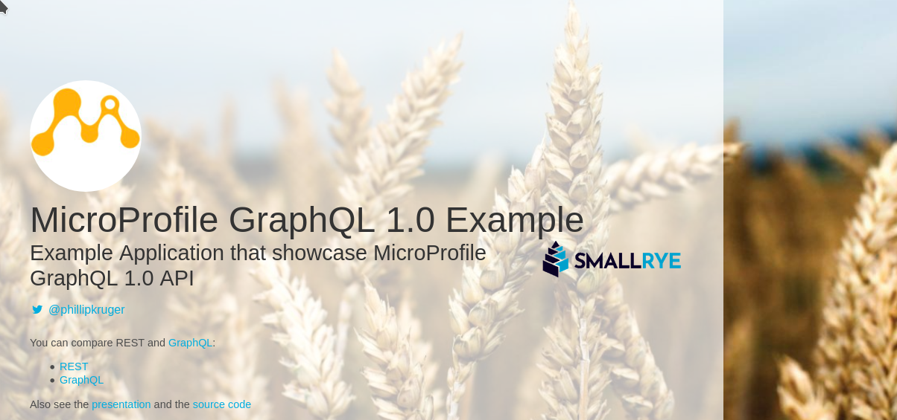

# MicroProfile GraphQL Example

This is an example of the [MicroProfile GraphQL API](https://github.com/eclipse/microprofile-graphql/) 
using the [SmallRye Implementation](https://github.com/smallrye/smallrye-graphql). It's done as part of these blog posts:
 
- [Microprofile GraphQL Introduction](https://www.phillip-kruger.com/post/microprofile_graphql_introduction/)
- [Supersonic Subatomic GraphQL](https://www.phillip-kruger.com/post/supersonic_subatomic_graphql/)

and these presentations and videos: 

- [#OffTheChain](https://www.youtube.com/watch?v=OOTkQBCtYg0)
- [joziJUG](https://bit.ly/mp-graphql-presentation-jozijug), ([video](https://youtu.be/UqDdDYo-g-8))
- [SouJava](http://bit.ly/mp-graphql-presentation-soujava), ([video](https://youtu.be/OOnpUeblVPM))
- [dev.next](http://bit.ly/mp-graphql-devdotnext)
- [DevConf.cz](http://bit.ly/mp-graphql-presentation-2020) ([video](https://www.youtube.com/watch?v=lA0L7iB-GV8))
- [Java cloud conference](http://bit.ly/mp-graphql-presentation)

The services are exposed with both REST and GraphQL for comparison.

## Person example

This example expose person data as well as scores that the person got for certain activities.

### Running in Wildfly

```
cd wildfly-example
mvn wildfly:run
```

### Running in Quarkus

```
cd quarkus-example
mvn quarkus:dev
```

This will start the application on port 8080.

## Testing

Go to http://localhost:8080 to test the application.

- Click on the 'REST' link to open Swagger UI to test the JAX-RS services.
- Click on the 'GraphQL' link to open GraphiQL UI to test the MicroProfile GraphQL service.

To stop the application, `ctrl-c` in the maven session.



### Examples

#### Demo 1 : MicroProfile GraphQL vs JAX-RS 

##### REST

```
curl -X GET "http://localhost:8080/rest/profile/1" -H  "accept: application/json"
```

##### GraphQL

```
{
  profileFull(personId:1) {
    person{
      surname
    }
    scores{
        name
        value
    }
  }
}
```

#### Demo 2: Query

```
{
  profile(personId:1){
    person{
      surname
    }
    scores{
      name
      value
    }
  }
}
```

in the log file:

```
======= Getting person [1] =======
======= Getting scores [512-46-5065] =======
```

without score

```
{
  profile(personId:1){
    person{
      surname
    }
  }
}
```

in the log file:

```
======= Getting person [1] =======
```

#### Demo 3: Query

```
{
  person(personId:1){
    surname
    scores{
      name
      value
    }
  }
}
```

or without score

```
{
  person(personId:1){
    surname
  }
}
```

or more people

```
{
  person1:person(personId:1){
    surname
    scores{
      name
      value
    }
  }
  person2:person(personId:2){
    surname
  }
}
```

#### Demo 4: Collections

```
{
  people{
     surname
  }
}
```

#### Demo 5: Mutations

```
mutation CreatePerson{
  updatePerson(person : 
    {
      names: "Phillip"
    }
  ){
    id
    names
    surname
    profilePictures
    website
  }
}
```

and then update using the generated id

```
mutation UpdatePerson{
  updatePerson(person : 
    {
      id: 101, 
      names:"Phillip",
      surname: "Kruger", 
      profilePictures: [
        "https://pbs.twimg.com/profile_images/1170690050524405762/I8KJ_hF4_400x400.jpg"
      ],
      website: "http://www.phillip-kruger.com"
    }){
    id
    names
    surname
    profilePictures
    website
  }
}
```

and then delete using the id

```
mutation DeletePerson{
  deletePerson(id :101){
    id
    names
    surname
    profilePictures
    website
  }
}
```

#### Demo 6: Errors and partial responses

##### Validation Errors

```
{
  people{
     surname
     scores{
      thisDoesNotExist
    }
  }
}
```

##### Partial results

```
{
  person(personId:1){
    names
    surname
    scores2 {
      name
      value
    }
  }
}
```

#### Demo 7: More complex graphs

```
{
  person(personId:1){
    names
    surname
    scores {
      name
      value
      events{
        dateTime
        action
      }
    }   
  }
}
```

#### Demo 8: JsonB Annotations support

```
{
  person(personId:1){
    names
    surname
    scores {
      name
      value
      events{
        when
        action
      }
    }   
  }
}
```

#### Demo 9: Introspection

```
{
  __schema{
    types {
      name
      kind
    }
  }
}
 
```

#### The Introspection query used by GrapiQL

```
query IntrospectionQuery {
  __schema {
    queryType { name }
    mutationType { name }
    subscriptionType { name }
    types {
      ...FullType
    }
    directives {
      name
      description
      locations
      args {
        ...InputValue
      }
    }
  }
}

fragment FullType on __Type {
  kind
  name
  description
  fields(includeDeprecated: true) {
    name
    description
    args {
      ...InputValue
    }
    type {
      ...TypeRef
    }
    isDeprecated
    deprecationReason
  }
  inputFields {
    ...InputValue
  }
  interfaces {
    ...TypeRef
  }
  enumValues(includeDeprecated: true) {
    name
    description
    isDeprecated
    deprecationReason
  }
  possibleTypes {
    ...TypeRef
  }
}

fragment InputValue on __InputValue {
  name
  description
  type { ...TypeRef }
  defaultValue
}

fragment TypeRef on __Type {
  kind
  name
  ofType {
    kind
    name
    ofType {
      kind
      name
      ofType {
        kind
        name
        ofType {
          kind
          name
          ofType {
            kind
            name
            ofType {
              kind
              name
              ofType {
                kind
                name
              }
            }
          }
        }
      }
    }
  }
}
```

### Schemas

- REST: http://localhost:8080/openapi
- GraphQL: http://localhost:8080/graphql/schema.graphql